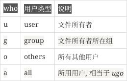
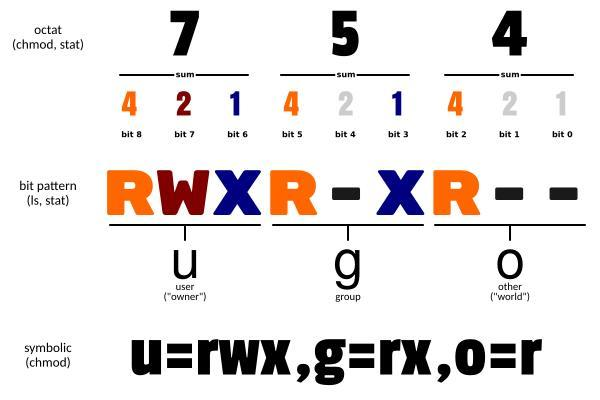

# 文件权限

## 1. 文件权限

### 1.1 文件基本权限

-rw-r--r--

- 文件类型
  - `-` 文件
  - `d` 目录
  - `l` 软链接文件
- 所有者 所属组 其它人
- r 读 w 写 x 执行

### 1.2 基本权限的修改

chmod [选项] 模式 文件名

- 选项
  - `-R` : 递归
  - `-c` : 若该文件权限确实已经更改，才显示其更改动作
  - `-f` : 若该文件权限无法被更改也不要显示错误讯息
  - `-v` : 显示权限变更的详细资料
- 模式
  - [ugoa][+-=][rwx]
  - 
  - 
- 权限数字
  - r 4
  - w 2
  - x 1

```sh
chmod 000 1.txt
chmod u+w 1.txt
chmod g+x 1.txt
chmod o+r 1.txt

chmod g+x,o+x 1.txt

chmod u-w 1.txt

chmod u=rwx 1.txt

chmod 777 1.txt
```

### 1.3 权限的作用

- 对文件来说最高权限是`x`
- 对目录来讲最高权限是`w`,只有读权限没有意义，对目录有了写权限，里面可以做任何事情

### 1.3.1 文件权限

| 权限 | 含义                                                     | 示例               |
| ---- | -------------------------------------------------------- | ------------------ |
| r    | 读取文件内容                                             | cat more head tail |
| w    | 编辑、新增、修改文件内容,不能删除文件,除非对目录有写权限 | vi echo            |
| x    | 可执行                                                   |                    |

### 1.3.2 目录权限

| 权限 | 含义                                                             | 示例           |
| ---- | ---------------------------------------------------------------- | -------------- |
| r    | 可以查看目录下的文件名                                           | ls             |
| w    | 具有修改目录结构的权限。如新建、删除和重命名此目录下的文件和目录 | touch rm mv cp |
| x    | 进入目录                                                         | cd             |

```sh
useradd zf1
passwd zf1

cd /home/zf1
mkdir folder
touch folder/1.txt 默认 755
chmod 750 folder
chmod 640 folder/1.txt
chmod 754 folder
chmod 755 folder
chmod 644 folder/1.txt
chmod 646 folder/1.txt
chmod 757 folder
```

<!-- https://baijiahao.baidu.com/s?id=1723058718794774392&wfr=spider&for=pc -->



### 1.1.3 其它权限命令

### 1.1.3.1 chown

- chown 用户名 文件名
- 如果想让一个用户拥有 7 权限，可以把这个文件的所有者改成这个用户名

```sh
chmod 755 folder
chown zf1 folder
```

### 1.1.3.2 chgrp

- chgrp 组名 文件名
- 创建用户名的时候会为它创建一个所属组

```sh
chgrp zf1 folder
chown root:root folder
```

## 2.默认权限

### 2.1 umask

查看默认权限
0022
第一位 0 文件特殊权限
022 文件默认权限

### 2.2 文件权限

- 默认权限就是文件一创建后就拥有的权限
- 文件默认不能建立可执行文件，必须手工赋予执行权限
- 文件默认权限最大为 666
- 默认权限需要换算成字母再相减
- 建立文件之后的默认权限，为 666 减去 umask 值
  666 - 022 = 744

### 2.3 目录

- 目录默认权限最大为 777
- 建立目录之后的默认权限，为 777 减去 umask 值
  777 - 022 = 755

### 2.4 修改 umask 值

- 临时修改

```sh
umask 0002
```

- 永久修改

```sh
vi /etc/profile
```

## 3. sudo 权限

- root 把本来只有超级管理员可以使用的命令赋予普通用户来使用
- sudo 操作的对象是系统命令

### 3.1 visudo

- 通过 visudo 可以由超级用户赋权
- 实际修改的是/etc/sudoers 文件
- 命令必须写绝对路径

```sh
root ALL=(ALL) ALL
用户名 被管理主机地址=(可使用的身份) 授权命令(绝对路径)

stu2 ALL=(root) ALL //新增加用户行
```


